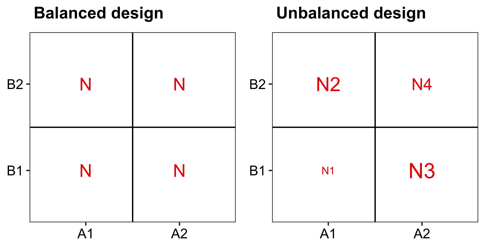

layout: true
  
<div class="my-footer"><span>Qiao-Guo Tan/CEE/XMU | tanqg@xmu.edu.cn | 2025-May-21   
&emsp;&emsp;&emsp;&emsp;&emsp;&emsp;&emsp;&emsp;&emsp;&emsp;&emsp;&emsp;&emsp;
&emsp;&emsp;&emsp;&emsp;&emsp;&emsp;&emsp;&emsp;&emsp;&emsp;&emsp;&emsp;&emsp;
</span></div> 


---
### 所用到的包
```{r warning=FALSE, message=FALSE}
library(tidyverse) 
library(car)
library(emmeans) #用于post-hoc多重比较
library(multcomp)
library(multcompView)
library(rstatix) #计算效应值
```

---
### ANOVA

* **One-way ANOVA**:  `aov(Y ~ A, data = d)`


<br>

* **Factorial ANOVA**
 - **Two-way ANOVA**:  `aov(Y ~ A + B, data = d)`
 - **Three-way ANOVA**:  `aov(Y ~ A + B + C, data = d)`
 - ...
 
---

class: inverse, middle, center 

# 1
## Two-way ANOVA的相关基本概念   


---
### 原假设与备择假设  

* Two-way ANOVA有**三条原假设**：
1. 因子A各个水平的均值相等

2. 因子B各个水平的均值相等

3. 因子A和B之间无交互作用 (interaction)

<br>


* **备择假设**
 - 原假设1，2的备择假设是：至少有一组均值不等
 
 - 原假设3的备择假设是：因子A和B之间存在交互作用

???
There is no difference in the means of factor A
There is no difference in means of factor B
There is no interaction between factors A and B
The alternative hypothesis for cases 1 and 2 is: the means are not equal.

The alternative hypothesis for case 3 is: there is an interaction between A and B.


---
### 均衡设计 vs. 非均衡设计
.large[
* **均衡设计** (balanced design)：各处理的样本数相等  

* **非均衡设计** (unbalanced design)：各处理的样本数不完全相等  

* 非均衡的ANOVA更为复杂

* 尽量设计均衡的实验，采集均衡的数据  
]

```{r echo=F, out.width=489*1.1, out.height=250*1.1}

```


```{r eval=FALSE, echo=FALSE}
d_balance <- data.frame(  x   = c("A1", "A1", "A2", "A2"),
           group = c("B1", "B2", "B1", "B2"),
           label     = c("N", "N", "N", "N"))

p_b <- ggplot(d_balance, aes(x, group))+
  theme_bw()+
  geom_point(alpha=0)+
  geom_hline(yintercept=1.5)+
  geom_vline(xintercept=1.5)+
  geom_text(aes(label=label), size = 5, color = "red2")+
  theme(panel.grid = element_blank())+
   theme(axis.text.x = element_text(color="black", size=11),
         axis.text.y = element_text(color="black", size=11))+
  labs(x=NULL, y=NULL)+
  ggtitle(~bold("Balanced design"))


d_balance <- data.frame(  x   = c("A1", "A1", "A2", "A2"),
           group = c("B1", "B2", "B1", "B2"),
           label     = c("N1", "N2", "N3", "N4"),
           size = c(3,3.7,4,3.3))

p_ub <- ggplot(d_balance, aes(x, group))+
  theme_bw()+
  geom_point(alpha=0)+
  geom_hline(yintercept=1.5)+
  geom_vline(xintercept=1.5)+
  geom_text(aes(label=label,size = size), color = "red2")+
  theme(panel.grid = element_blank())+
   theme(axis.text.x = element_text(color="black", size=11),
         axis.text.y = element_text(color="black", size=11))+
  labs(x=NULL, y=NULL)+
  ggtitle(~bold("Unbalanced design"))+
  scale_size(range=c(3,6))+
  guides(size="none")

cowplot::plot_grid(p_b, p_ub)
ggsave("figs/balanced.png", width=489/90, height=250/90, dpi=600)
```


---
### 交互作用
.large[
当存在**交互作用**时，一个因子的影响取决于另一个因子的水平。
]
```{r echo=F, out.width=795, out.height=436}

```


```{r eval=FALSE, echo=FALSE}
d1 <- data.frame(x     = c("A1", "A1", "A2", "A2"),
           group = c("B1", "B2", "B1", "B2"),
           y     = c(3, 2.7, 3, 2.7),
           sd = c(0.3, 0.3, 0.3, 0.3))
p1 <- ggplot(d1, aes(x, y, color = group))+
  theme_bw()+
  geom_point()+
  geom_errorbar(aes(ymin=y-sd, ymax=y+sd), width=0.1, alpha=0.6)+
  geom_line(aes(group=group))+
  scale_y_continuous(limits=c(0,4))+
  geom_text(data=subset(d1, x=="A2"), aes(label=group), nudge_x = 0.2)+
  guides(color="none")+
  labs(y = ~italic("Y"), x=NULL)+
  theme(axis.text.x = element_text(color="black", size=11))+
  scale_color_manual(values=c("black", "red2"))+
  ggtitle("No A, B Effects;\nNo Interaction")

p1

d2 <- data.frame(x     = c("A1", "A1", "A2", "A2"),
           group = c("B1", "B2", "B1", "B2"),
           y     = c(3, 2, 3, 2),
           sd = c(0.3, 0.3, 0.3, 0.3))
p2 <- ggplot(d2, aes(x, y, color = group))+
  theme_bw()+
  geom_point()+
  geom_errorbar(aes(ymin=y-sd, ymax=y+sd), width=0.1, alpha=0.6)+
  geom_line(aes(group=group))+
  scale_y_continuous(limits=c(0,4))+
  geom_text(data=subset(d2, x=="A2"), aes(label=group), nudge_x = 0.2)+
  guides(color="none")+
  labs(y = ~italic("Y"), x=NULL)+
  theme(axis.text.x = element_text(color="black", size=11))+
  scale_color_manual(values=c("black", "red2"))+
   ggtitle("B Effect;\nNo Interaction")
p2


d3 <- data.frame(x     = c("A1", "A1", "A2", "A2"),
                 group = c("B1", "B2", "B1", "B2"),
                 y     = c(2, 2.4, 3, 3.4),
                 sd    = c(0.3, 0.3, 0.3, 0.3))
p3 <- ggplot(d3, aes(x, y, color = group))+
  theme_bw()+
  geom_point()+
  geom_errorbar(aes(ymin=y-sd, ymax=y+sd), width=0.1, alpha=0.6)+
  geom_line(aes(group=group))+
  scale_y_continuous(limits=c(0,4))+
  geom_text(data=subset(d3, x=="A2"), aes(label=group), nudge_x = 0.2)+
  guides(color="none")+
  labs(y = ~italic("Y"), x=NULL)+
  theme(axis.text.x = element_text(color="black", size=11))+
  scale_color_manual(values=c("black", "red2"))+
  ggtitle("A Effect;\nNo Interaction")
p3


d3.1 <- data.frame(x     = c("A1", "A1", "A2", "A2"),
                 group = c("B1", "B2", "B1", "B2"),
                 y     = c(1, 2, 2, 3),
                 sd    = c(0.3, 0.3, 0.3, 0.3))

p3.1 <- ggplot(d3.1, aes(x, y, color = group))+
  theme_bw()+
  geom_point()+
  geom_errorbar(aes(ymin=y-sd, ymax=y+sd), width=0.1, alpha=0.6)+
  geom_line(aes(group=group))+
  scale_y_continuous(limits=c(0,4))+
  geom_text(data=subset(d3.1, x=="A2"), aes(label=group), nudge_x = 0.2)+
  guides(color="none")+
  labs(y = ~italic("Y"), x=NULL)+
  theme(axis.text.x = element_text(color="black", size=11))+
  scale_color_manual(values=c("black", "red2"))+
  ggtitle("A & B Effects;\nNo Interaction")
p3.1


d4 <- data.frame(x     = c("A1", "A1", "A2", "A2"),
                 group = c("B1", "B2", "B1", "B2"),
                 y     = c(2, 3, 3, 2),
                 sd    = c(0.3, 0.3, 0.3, 0.3))
p4 <- ggplot(d4, aes(x, y, color = group))+
  theme_bw()+
  geom_point()+
  geom_errorbar(aes(ymin=y-sd, ymax=y+sd), width=0.1, alpha=0.6)+
  geom_line(aes(group=group))+
  scale_y_continuous(limits=c(0,4))+
  geom_text(data=subset(d4, x=="A2"), aes(label=group), nudge_x = 0.2)+
  guides(color="none")+
  labs(y = ~italic("Y"), x=NULL)+
  theme(axis.text.x = element_text(color="black", size=11))+
  scale_color_manual(values=c("black", "red2"))+
  ggtitle("No A, B Effects;\nInteraction Effect")
p4


d5 <- data.frame(x     = c("A1", "A1", "A2", "A2"),
                 group = c("B1", "B2", "B1", "B2"),
                 y     = c(2.2, 2, 3, 1.2),
                 sd    = c(0.3, 0.3, 0.3, 0.3))
p5 <- ggplot(d5, aes(x, y, color = group))+
  theme_bw()+
  geom_point()+
  geom_errorbar(aes(ymin=y-sd, ymax=y+sd), width=0.1, alpha=0.6)+
  geom_line(aes(group=group))+
  scale_y_continuous(limits=c(0,4))+
  geom_text(data=subset(d5, x=="A2"), aes(label=group), nudge_x = 0.2)+
  guides(color="none")+
  labs(y = ~italic("Y"), x=NULL)+
  theme(axis.text.x = element_text(color="black", size=11))+
  scale_color_manual(values=c("black", "red2"))+
  ggtitle("B Effect;\n& Interaction Effect")
p5


d6 <- data.frame(x     = c("A1", "A1", "A2", "A2"),
                 group = c("B1", "B2", "B1", "B2"),
                 y     = c(1, 2, 4, 3),
                 sd    = c(0.3, 0.3, 0.3, 0.3))
p6 <- ggplot(d6, aes(x, y, color = group))+
  theme_bw()+
  geom_point()+
  geom_errorbar(aes(ymin=y-sd, ymax=y+sd), width=0.1, alpha=0.6)+
  geom_line(aes(group=group))+
  scale_y_continuous(limits=c(0,4.3))+
  geom_text(data=subset(d6, x=="A2"), aes(label=group), nudge_x = 0.2)+
  guides(color="none")+
  labs(y = ~italic("Y"), x=NULL)+
  theme(axis.text.x = element_text(color="black", size=11))+
  scale_color_manual(values=c("black", "red2"))+
  ggtitle("A Effect;\n& Interaction Effect")
p6


d7 <- data.frame(x     = c("A1", "A1", "A2", "A2"),
                 group = c("B1", "B2", "B1", "B2"),
                 y     = c(1, 1.5, 3, 1.2),
                 sd    = c(0.3, 0.3, 0.3, 0.3))
p7 <- ggplot(d7, aes(x, y, color = group))+
  theme_bw()+
  geom_point()+
  geom_errorbar(aes(ymin=y-sd, ymax=y+sd), width=0.1, alpha=0.6)+
  geom_line(aes(group=group))+
  scale_y_continuous(limits=c(0,4.3))+
  geom_text(data=subset(d7, x=="A2"), aes(label=group), nudge_x = 0.2)+
  guides(color="none")+
  labs(y = ~italic("Y"), x=NULL)+
  theme(axis.text.x = element_text(color="black", size=11))+
  scale_color_manual(values=c("black", "red2"))+
  ggtitle("A, B Effects;\n& Interaction Effect")
p7


cowplot::plot_grid(p1,p2,p3,p3.1, p4,p5,p6,p7, ncol=4)
ggsave("figs/interaction.png", width=795/90, height=436/90, dpi=600)
```
???
Demystifying Statistics: On the interpretation of ANOVA effects
https://skeetersays.wordpress.com/2008/08/12/demystifying-statistics-on-the-interpretation-of-anova-effects/

---
### 主效应（Main Effect）
.large[
* 当交互作用不显著时，查看**主效应**  

* 因子A的主效应：忽略因子B的存在，比较因子A各个水平的均值  

* 因子B的主效应：忽略因子A的存在，比较因子B各个水平的均值  
]
```{r echo=F, out.width=2418/2.2, out.height=780/2.2}

```

---
### 简单效应（Simple Effect）
.large[
* 当交互作用显著时，应谨慎解释主效应，因为这可能会产生误导（后面详述） 

* 此时，可主要解释**简单效应**  

* **简单效应**是指一个因子在"另一个因子的一个水平上"的效应
]
```{r echo=F, out.width=2382/2.5, out.height=976/2.5}

```


---

class: inverse, middle, center 
# 2
## Two-way ANOVA的一般流程   


---
### Two-way ANOVA的一般流程

1. **建立包含主效应和交互作用的模型**
 - `aov(Y ~ A * B, data = d)`
 - 检验交互作用  
<br>
2. **如果交互作用不显著**
 - 则单独检验主效应（使用多重比较）
 - 可在不包含交互作用项的情况下重新aov进行分析，即`aov(Y ~ A + B, data = d) `   
<br>
3. **如果交互作用显著**
 - 确定交互作用是否**重要**
 - 如果不重要，可像步骤2一样检验主效应  
<br>
4. **如果交互作用存在且重要**
 - 确定交互作用是**简单**的还是**复杂**的  
<br>
5. **对于简单的交互作用**
 - 仍然可以讨论因子A在因子B的每个水平上的效应（简单效应，也称为简单主效应）   
<br>
6. **对于复杂的交互作用**
 - 须将所有因子组合视为单独的处理（转化为one-way ANOVA）


???
1. Set up model with main effects and interaction(s), check assumptions, and
examine interaction(s).
2. If no significant interaction, examine main effects individually, using appropriate
adjustments for multiple comparisons, main effects plots, etc.
• Note one could also possibly re-run the analysis without the interaction term 

3. If interaction is significant, determine whether interactions are important. If not, can examine main effects as in Step 2.
4. If interaction present & important, determine whether interaction is simple or complex.
5. For simple interactions, can still talk about the main effects of A at each level of B
6. For complex interaction, must simply consider all pairs of levels as separate
treatments.

---
### 什么是“不重要的交互作用”？
.large[
* 与主效应相比，交互作用**非常小**，或者只在少数处理中出现  

* 线虽不完全平行，但**接近平行**  
]


--
<br>
### 若交互作用显著，但不重要 
.large[
* 可在模型中**保留**交互作用，同时检验每个重要的主效应
]

???
（Unimportant Interactions）
• If interaction effects are very small compared to main effects or only apparent
in a small number of treatments, then they are probably unimportant.
• Lines will be not quite parallel, but close.
• We can proceed by keeping interaction in the model, but using marginal means for each significant main effect individually
• Marginal means: Averages over the levels of the other factor. 

---
### 什么是“重要的交互作用”？
.large[
* 交互效应非常大或普遍，以至于不能单独解释主效应  
<br>
* 在交互作用图中，线条不是平行的
 - 它们可能交错，也可能不交错
 - 一个因子影响的大小取决于另一个因子的水平
]   
  
  
--


### 交互作用重要时，怎么办？ 
.large[
* 报告结果时，说明交互作用是显著的  

* 讨论简单效应  

* 分析交互作用：把所有AB组合视为处理，等同于做单因素方差分析
]

???
（Important Interactions）
• The interaction effect is so large and/or pervasive that main effects cannot be interpreted on their own.
• In interaction plots, the lines will not be parallel. They may or may not criss-cross, but the differences between levels for one factor will depend on the level of the other factor 

Options include the following:
• Analyze interaction – Similar to interpreting as a one-way ANOVA with ab levels; use
Tukey to compare means; contrasts and estimate can also be useful.
• Report that the interaction is significant; plot the means and describe the pattern.
• Discuss results for the levels of A for each level of B or vice versa 

---
### 交互作用是简单的，还是复杂的？
.large[
- **简单的交互作用**：可以描述出一个因子在另一个因子的每个水平下的效应趋势，并且总体趋势相同  

<br>
- **复杂的交互作用**：很难描述出任何因子的效应趋势  
 - 若如此，把AB因子所有组合视为处理，做类似于单因素方差分析
]
???
Simple vs. Complex Interactions
• An interaction is considered simple if we can discuss trends for the main effect of
one factor for each level of the other factor, and if the general trend is the same.
• An interaction is complex if it is difficult to discuss anything about the main effects. In this situation, one can only look at treatment combinations and cannot separate them into main effects easily. 

---

class: inverse, middle, center 
# 3
## 以`ToothGrowth`数据为例
## 做均衡设计的Two-way ANOVA   

---
### 了解数据`ToothGrowth`

.pull-left[
```{r}
head(ToothGrowth)
```
]

.pull-right[

<br>

* 响应变量：牙齿长度（`len`）  
* 两个因子：补充剂类型（`supp`）、剂量（`dose`）  
]

--

.pull-left[
```{r}
table(ToothGrowth$supp, ToothGrowth$dose)
```
]

.pull-right[

<br>

* 每个处理（treatment、cell）均有10个样本
* 实验设计是“balanced”
]


---
.pull-left[
### 统计分析前，先可视化

* 先作图查看有无可观察的效应；若有，再看能否得到统计分析的支持  

<br>

* 不要迷信*p*值  

 - 可能真实效应**可忽略**，但*p*值很小  
 
 - 可能真实效应**很重要**，但*p*值很大  
 
 - *p*值大，表示观察到的差别可能源自随机波动，但并不表示无效应，这取决于样本数和误差的大小  

]

.pull-right[
```r
ggplot(ToothGrowth, aes(dose, len, color = supp))+
  geom_jitter(width = 0.1)+
  stat_summary(geom = "line", fun = mean, aes(group = supp))
```
```{r echo=F, out.width=310*1.4, out.height=260*1.4}

```
]


???
ggsave("figs/tooth_0.png", width=310/90, height=260/90, dpi=600)


---
### 提出问题  
.large[
* 牙齿生长是否受维C剂量（`dose`）的影响？  
  
  
* 牙齿生长是否受维C补充剂类型（`supp`）的影响？  
  
  
* 两个因素在影响牙齿生长时有无交互作用？
]
---
### 双因素方差分析`aov()`


```{r}
ToothGrowth$dose <- factor(ToothGrowth$dose) # dose目前是numeric变量，需转为factor
mod.1 <- aov(len ~ supp * dose, data = ToothGrowth) 
summary(mod.1)
```

**解读**：  
- 首先看`supp:dose`：`dose`和`supp`在影响`len`时存在显著交互作用（*p* = 0.022）
- 交互作用虽显著，但相比`supp`和`dose`的主效应都小很多，图上也可看到两个因子效应的明确趋势，因此可保留交互效应，同时分析`supp`和`dose`的主效应
- 维C补充剂的类型和剂量均对牙齿生长有显著影响（*p* < 0.001）  
- A two-way ANOVA was carried out on tooth growth by vitamin C supplement type and dose. There was a significant interaction between the effects of supplement type and dose on tooth growth [*F*(2, 54) = 4.107, *p* = 0.022].

---
### 查看交互作用的重要性  

```{r}
rstatix::eta_squared(mod.1)
```
* 使用`rstatix`包中的`eta_squared()`函数计算效应值，效应值表示每个因子的主效应及交互作用所解释的方差比例。交互作用的效应值较小（0.02575745），交互作用不重要。


---
### 双因素方差分析`aov()`
.large[
若结果显示无交互作用，则用`+`代替`*`号重新分析：  
]

```{r}
mod.1a <- aov(len ~ supp + dose, data = ToothGrowth) 
summary(mod.1a)
```

???
### 查看交互作用是否重要
```{r}
emmip(mod.1,  supp ~ dose)
```


---

class: inverse, middle, center 
# 3.1
## 运用`TukeyHSD`函数
## 进行*post-hoc*检验   

---
### *post hoc*检验


- **`dose`的主效应**

```{r}
post.1 <- TukeyHSD(mod.1, which = "dose")
post.1
```


---
### *post hoc*检验：标注结果  

```{r}
p.value <- post.1$dose[,4]

let <- multcompView::multcompLetters(p.value) 

let
```


---

### *post hoc*检验：`TukeyHSD()`检验全部组合之间的差异
.large[
* 如果交互作用**显著且重要**，则检验主效应无意义，但可检验所有`supp * dose`组合之间的差异  

* 注意：此处交互作用并非**显著且重要**，以下仅作演示用  
]

```{r}
TukeyHSD(mod.1)$`supp:dose`
```

---

### *post hoc*检验：`TukeyHSD()`，标注字母


```{r}
p.value <- TukeyHSD(mod.1)$'supp:dose'[,4]

let <- multcompView::multcompLetters(p.value) 

let
```

**解读**：Tukey’s HSD *post hoc* tests indicate that when organge juice was used, dose 1 and 2 had significantly higher effects than dose 0.5 (both *p* < 0.001), while the effects were not significantly different between dose 1 and dose 2 (*p* = 0.319). In comparision,  when VC was used, effects significantly increased with the increases of dose from 0.5 to 1 (*p* < 0.001) and from 1 to 2 (*p* < 0.001).

???
表述方式
The main effect of student age on IQ was not significant (F(1,36) = 1.125, p = .296) but
the main effect of teacher expectation on IQ was significant such that students whose
teachers had high expectations received higher scores than students whose teachers
had normal expectations, (F(1,36) = 10.125, p = .003).

The high-expectation group scored significantly higher than the low-expectation group
(F(1,36) = 10.125, p = .003), while the scores of 7-year-olds and 15-year-olds were not
significantly different (F(1,36) = 1.125, p = .296).

### *post hoc*检验：标注结果的另一种方法
```r
library(lsmeans)
post.3 <- lsmeans(mod.1, 
        pairwise ~ dose * supp,
        adjust="tukey")
contrast <- as.data.frame(post.3$contrasts)
p.value <- contrast$p.value
name <- gsub(" - ","-",contrast$contrast)
names(p.value) <- name
let <- multcompLetters(p.value, compare="<", threshold=0.05, Letters=letters, reversed = F) 
let
```

---

### *post hoc*检验：图上标注检验结果  

.pull-left67[
```r
#根据上一页的结果，将字母放入数据表
d_pvalue <- data.frame(supp=c("VC","OJ","VC","OJ","VC","OJ"), dose=c("0.5","1","1","2","2","0.5"), label = as.vector(let$Letters)) 

#设定标注字母的y坐标，并于字母数据表合并
d_label <- ToothGrowth |>
  group_by(supp, dose) |>
  summarise(y_pos=max(len)) |>
  left_join(d_pvalue, by=c("dose", "supp"))

ggplot(ToothGrowth, aes(factor(dose), len, color=supp))+
  geom_boxplot(outlier.alpha = 0)+
  geom_jitter(position=position_jitterdodge(jitter.width =0.4))+
  labs(x="Dose of VC (mg/d)", y="Tooth length (cm)", color=NULL)+
  theme(legend.position = c(0.85, 0.2))+
 geom_text(data=d_label, aes(x=dose, y=y_pos+2, label=label, group=supp), color="black", position=position_dodge(width=0.7))

```
]

.pull-right67[
```{r echo=F, out.width=438/1.4, out.height=377/1.4}

```
]

???
ggsave("figs/tooth_3.png", width=438/90, height=377/90, dpi=600)

---

class: inverse, middle, center 
# 3.2
## 运用`emmeans`包
## 进行自定义的*post-hoc*检验   


???
The emmeans package is one of several alternatives to facilitate post hoc methods application and contrast analysis. It is a relatively recent replacement for the lsmeans package that some R users may be familiar with.

Estimated marginal means are based on a model – not directly on data. 

---
### `emmeans`包分析`dose`的**主效应**

```{r}
mod.1 <- aov(len ~ supp * dose, data = ToothGrowth) 

emmeans(mod.1, specs = pairwise ~ dose) |> 
  multcomp::cld(Letters = letters)
```


---
### `emmeans`包分析`supp`的**主效应**
```{r}
emmeans(mod.1, specs = pairwise ~ supp) |> 
  multcomp::cld(Letters = letters)
```
注：此处`supp`只有两个水平，不存在多重比较，此处只是演示用法  


---
### `emmeans`包分析全部组合之间的差异
* 等效于one-way ANOVA  

```{r}
emm.out <- emmeans(mod.1, specs = pairwise ~ supp:dose)


emmeans(mod.1, specs = pairwise ~ supp:dose) |> 
   multcomp::cld(Letters = letters) 
 
```


---
### `emmeans`包分析`dose`的**简单效应**
```{r}
emmeans(mod.1, ~ dose | supp) |> 
  multcomp::cld(Letters = letters)
```


---
### `emmeans`包分析`supp`的**简单效应**
```{r}
emmeans(mod.1,  ~ supp | dose) |> 
  multcomp::cld(Letters = letters)


```


---
### `emmeans`包自定义对照（contrast）进行多重比较
目的：尽量减少多重比较的次数，提高分析效能（power）

* **以第1组作为对照**  
此处第1组是`OJ dose0.5`，其他所有组都与之比较，将比较次数减少到了5次
```{r}
emmeans(mod.1, specs = trt.vs.ctrl ~supp : dose) $contrast
```

---
### `emmeans`包自定义对照（contrast）进行多重比较
目的：尽量减少多重比较的次数，提高分析效能（power）

* **以任意组为对照**  
通过`ref`设置任意组为对照；此处ref = 2，即设置第2组（`VC dose0.5`组）为对照
```{r}
emmeans(mod.1, specs = trt.vs.ctrlk ~supp : dose, ref = 2) $contrast
```


---

class: inverse, middle, center 
# 3.3
## Two-way ANOVA的诊断   


---
### 检验残差正态分布

```{r}
resid <- mod.1$residuals
shapiro.test(resid)
```

- *p* > 0.05，不拒绝正态分布原假设，可认为残差符合正态分布。

???
Normality checks and Levene’s test were carried out and the assumptions were met.

---
### 检验方差齐性  

- **检验所有`supp`和`dose`组合的方差齐性**
```{r message=F}

car::leveneTest(len ~ supp*dose, data = ToothGrowth) 
```


- *p* > 0.05，不拒绝方差齐性原假设，可认为符合方差齐性。
---

### 检验方差齐性  

- **检验不同`supp`之间的方差齐性**
```{r}
car::leveneTest(len ~ supp, data = ToothGrowth)
```

- **检验不同`dose`之间的方差齐性**
```{r}
car::leveneTest(len ~ dose, data = ToothGrowth)
```

- *p* 值均> 0.05，不拒绝方差齐性原假设，可认为符合方差齐性。
---
### 诊断图  
```r
plot(mod.1)
```

```{r echo=F, out.width=3630/7, out.height=3157/7}

```

???
* You should check if your model does not violate assumtions
Assumptions what? you need the residuals to be normaly distributed. Equal variance (check for homoscedasticity, a difficult word that means equal variance). Outliers might cause issues.


durbinWatsonTest(fit.lm2, alternative="two.sided",data=data)
we do not reject the durbin watson test hence we have independence.


---

class: inverse, middle, center 
# 4
## 非均衡设计的Two-way ANOVA   

---
## Type I, II and III 平方和

.large[
* 对于**均衡设计**，类型I，II，III的计算结果都是一样的  

* 对于**非均衡设计**，计算结果不同  

* 应该使用哪种计算方式，目前仍有争议
]
???
NOTE: when data is balanced, the factors are orthogonal, and types I, II and III all give the same results.

When data is unbalanced, there are different ways to calculate the sums of squares for ANOVA.

Which type to use has led to an ongoing controversy in the field of statistics (for an overview, see Heer [2]). However, it essentially comes down to testing different hypotheses about the data.

---
### Type I 平方和

> SS(A) ：因子A的平方和  
> SS(B | A) ： 因子B的平方和  
> SS(A*B | B, A) ：AB交互作用的平方和

* 称为顺序平方和；若模型中因子先后顺序不同，则结果不同

* 不适用于非均衡设计  

* 用Base R自带函数计算Type I SS  
`aov()`  
`anova()` 

???
Type I, also called “sequential” sum of squares:

SS(A) for factor A.
SS(B | A) for factor B.
SS(A*B | B, A) for interaction AB.

The anova and aov functions in R implement a sequential sum of squares (type I). As indicated above, for unbalanced data, this rarely tests a hypothesis of interest,


---
### Type II 平方和

> SS(A | B) : 因子A的平方和  
> SS(B | A) : 因子B的平方和

* 在考虑了另一个因子的主效应之后考虑当前因子的主效应
* 若不存在交互作用，使用Type II

* 需用`car::Anova`计算：  
`Anova(lm(Y ~ A * B, data = d, type=2))`  
`Anova(lm(Y ~ A + B, data = d, type=2))`   

注意首字母A大写，需加载`car`包；若小写（`anova`）则是另一个函数

???
SS(A | B) for factor A.
SS(B | A) for factor B.
SS(A*B | A,B)
This type tests for each main effect after the other main effect.
If there is indeed no interaction, then type II is statistically more powerful than type III (see Langsrud [3] for further details).

 car::Anova(), which can calculate type II and III SS directly.

Anova(lm(time ~ topic * sys, data=search, type=2))

---
### Type III 平方和

> SS(A | B, A\*B) 因子A的平方和   
> SS(B | A, A\*B) 因子B的平方和  
> SS(A*B | A,B) AB交互作用的平方和  

* 在考虑了另一个因子的主效应和交互作用之后考虑当前因子的主效应   
* 适用于存在交互作用的非均衡设计  

* 需用`car::Anova`计算：  
`Anova(lm(Y ~ A * B, data = d, contrasts = list(A=contr.sum, B=contr.sum)), type=3)`


???
Type III are “partial.”
 
SS(A | B, A*B) for factor A.
SS(B | A, A*B) for factor B.
SS(A*B|A,B)
This type tests for the presence of a main effect after the other main effect and interaction. This approach is therefore valid in the presence of significant interactions.

However, it is often not interesting to interpret a main effect if interactions are present (generally speaking, if a significant interaction is present, the main effects should not be further analysed).

Type III:

Anova(lm(time ~ topic * sys, data=search, contrasts=list(topic=contr.sum, sys=contr.sum)), type=3))

options(contrasts = c("contr.sum", "contr.poly"))
 ### needed for type III tests
 ### Default is: options(contrasts = c("contr.treatment", "contr.poly"))


Summary: Usually the hypothesis of interest is about the significance of one factor while controlling for the level of the other factors. This equates to using type II or III SS. In general, if there is no significant interaction effect, then type II is more powerful, and follows the principle of marginality. If interaction is present, then type II is inappropriate while type III can still be used, but results need to be interpreted with caution (in the presence of interactions, main effects are rarely interpretable).


---
### 以数据`pigs`为例，做非均衡设计的Two-way ANOVA   

```{r}
data('pigs', package='emmeans') # 数据来自emmeans包
head(pigs)
table(pigs$source, pigs$percent) # 各组数据不等，即非均衡设计

```

---
### 可视化数据

.pull-left[
```r
ggplot(pigs, aes(percent, conc, color = source))+
  geom_jitter(width = 0.1)+
  stat_summary(geom = "line", aes(group = source), fun = mean)+
  scale_y_log10()
```
]

.pull-right[
```{r echo=F, out.width=384*1.2, out.height=311*1.2}

```
]

???
ggsave("figs/pigs_1.png", width =384/90, height=311/90, dpi=600 )
---
### 非均衡设计的Two-way ANOVA
```{r}
pigs$percent <- factor(pigs$percent) # numeric转为factor
mod.2 <- lm(log(conc) ~ source * percent, data = pigs) #lm()与aov()等效
```

* 默认采用Type II SS
```{r}
car::Anova(mod.2) # 等价于 Anova(mod.2, type = 2)
```
无显著交互作用，采用Type II SS合适

---
### 非均衡设计的Two-way ANOVA
若存在交互作用（注：此处非此情况，仅作演示目的），需采用Type III SS：

```{r}
mod.pigs <- lm(log(conc) ~ source * percent, data = pigs,
      contrasts = list(source = contr.sum, percent = contr.sum))
Anova(mod.pigs, type = 3) 

```

---
### *post-hoc* 检验

* `percent`的主效应
```{r}
emmeans(mod.2, specs = pairwise~percent) |> 
  cld(Letters = letters)
```

---
### *post-hoc* 检验

* `source`的主效应
```{r}
emmeans(mod.2, specs = pairwise~source) |> 
  cld(Letters = letters)
```

???
对比

```{r}
emmeans(lm(log(conc) ~ source + percent, data = pigs), specs = pairwise~percent) |> 
  cld(Letters = letters)

emmeans(lm(log(conc) ~ source + percent, data = pigs), specs = pairwise~source) |> 
  cld(Letters = letters)

```


???
```{r}
options(contrasts = c("contr.sum", "contr.poly"))

d.ABCr <- data.frame(A = c("a", "a", "a", "a", "b", "b", "b", "b", "b", "b", "b", "b"),
           B = c("x", "y", "x", "y", "x", "y", "x", "y", "x", "x", "x", "x"),
           C = c("l", "l", "m", "m", "l", "l", "m", "m", "l", "l", "l", "l"),
           response = c( 14,  30,  15,  35,  50,  51,  30,  32,  51,  55,  53,  55))

model = lm(response ~ A + B + C + A:B + A:C + B:C, data=d.ABCr)
anova(model)              # Type I tests
car::Anova(model, type="II")   # Type II tests
car::Anova(model, type="III")  # Type III tests
```


???
作业
```{r}
data('rats', package='faraway')

summary(aov(time ~ treat * poison, data = rats))

rats |> 
  ggplot(aes(poison, time, fill = treat))+
  geom_point()+
  geom_col(position = "dodge")+
  facet_wrap(~treat, nrow=1)

table(rats$poison, rats$treat)
fit.2 <- aov(time ~ treat + poison, data = rats)
summary(fit.2)

emmeans(fit.2, pairwise ~ treat) |> 
  cld()
  
emmeans(fit.2, pairwise ~ poison) |> 
  cld()
label <- emmeans(fit.2, pairwise ~ treat*poison) |> 
  multcomp::cld(Letters = letters) |> 
  mutate(.group=str_remove_all(.group, "\\s")) #去除标签里的空格

rats |> 
  ggplot(aes(poison, time))+
  geom_point()+
  facet_wrap(~treat, nrow=1) +
  geom_text(data = label, aes(y=1.3, label=.group))

```


---
### 小结：Two-way ANOVA的多重比较有多种方案
.large[根据研究需求选择使用。  

比较次数越少，检出显著性差异的效能越高。]

- **主效应**：  
  * 比较因子A的各个水平的数据，忽略因子B  
  * 比较因子B的各个水平的数据，忽略因子A 
  
- **简单效应**：  
  * 在因子A的每一个水平，比较因子B的多个水平   
  * 在因子B的每一个水平，比较因子A的多个水平  
  * 需注意控制第一类错误，α = 0.05/比较次数  
 
- **全部组合两两比较**

- **选定对照两两比较**


???

https://www.graphpad.com/guides/prism/8/statistics/stat_multiple_comparisons_tab_2way.htm  

Multiple comparisons tab: Two-way ANOVA


---
### 参考资料：

Field A., Miles J., Field Z. 2012. Discovering Statistics Using R. SAGE Publications Ltd. Chapter 11 Factorial ANOVA.

Comparisons and contrasts in emmeans (emmeans package, Version 1.7.4.1)  
https://cran.r-project.org/web/packages/emmeans/vignettes/comparisons.html


---
### 推荐阅读

1. Two-Way ANOVA Test in R   
http://www.sthda.com/english/wiki/two-way-anova-test-in-r

2. Salvatore S. Mangiafico. 2015. An R Companion for the Handbook of Biological Statistics. Two-way Anova.   
https://rcompanion.org/rcompanion/d_08.html

3. Feys, Jos. 2016. Nonparametric Tests for the Interaction in Two-way Factorial Designs Using R. The R Journal, 8(1):367-378. （2-way ANOVA的非参数方法，不常用）  
https://journal.r-project.org/archive/2016/RJ-2016-027/RJ-2016-027.pdf

???

2. ANOVA in R （`rstatix`程序包的使用，简化分析流程，包括3-way ANOVA）  
https://www.datanovia.com/en/lessons/anova-in-r/

需参考：https://rcompanion.org/handbook/G_06.html

参考：Mangiafico, S.S. 2015. An R Companion for the Handbook of Biological Statistics, version 1.3.2. 下载地址：http://biostathandbook.com/

